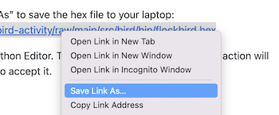
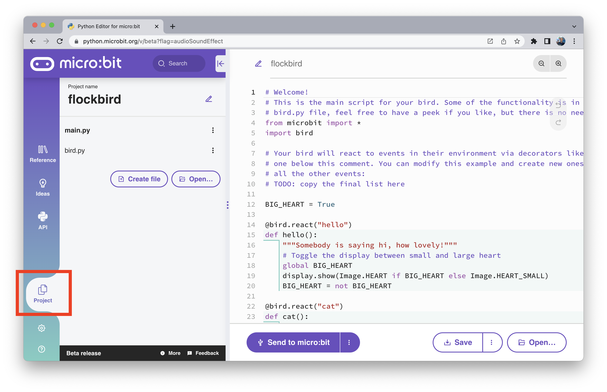
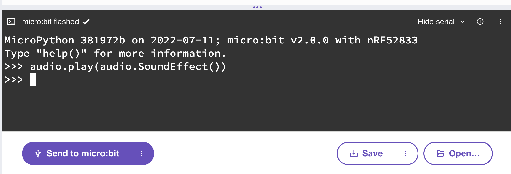

# It's alive

Let's bring our bird alive with code!

<p align="center">

</p>


## What is all this about?


We're building a beautiful flock of unique, original birds.

Your job, as a creator of one of the birds, is to think like a bird and
programme the micro:bit to react to the world like a bird. You might also find
that you have responsibilities to the flock too, like sharing useful
information.

The micro:bit can communicate wirelessly with other micro:bits using
[radio](https://microbit-micropython.readthedocs.io/en/v1.0.1/tutorials/radio.html#radio).
There will be a secret micro:bit in the room broadcasting radio messages to
all the birds denoting different events like "hi everyone" or "there is a
cat around".

Apart from that, the micro:bit contains other sensors that your bird will react
to, for example, birds don't like to be shaken! (we assume... no birds were
harmed in the making of this workshop - though they may have been subjected
to some unpleasant sounds from nearby micro:bits!).

To programme the micro:bit with Python we use
[MicroPython (click here for more info)](https://microbit-carlos.github.io/microbit-bird-activity/micropython/)
and our brand new
[Python Editor (click here for more info)](https://microbit-carlos.github.io/microbit-bird-activity/editor/).


## First steps - Load the starter project into the editor

<!-- This is no longer applicable
<p class="important">
❗️ Important: <br>
To be able to start the activity correctly we need to use the version of the
Python Editor linked here and the provided hex file in this section.
</p-->

Okay, so the first step is to open the micro:bit Python Editor:

<a href="https://python.microbit.org" target="_blank">https://python.microbit.org</a> 👈 🐍

To start the activity we first need to load a project hex file into the editor.

Right click on this link and select "Save Link As" to save the hex file to your
laptop: [https://github.com/microbit-carlos/microbit-bird-activity/raw/main/src/bird/bin/flockbird.hex](https://github.com/microbit-carlos/microbit-bird-activity/raw/main/src/bird/bin/flockbird.hex)



And then drag and drop the hex file to the Python Editor. The editor might
warn you that this action will replace the project, you can click "Replace" to
accept it.


### So... What am I looking at?

The loaded hex file contains two Python files, to see them let's go to the
"Project" section on the left sidebar:



In this view you can switch between the `main.py` file and the `bird.py`.

- The `bird.py` module contains some functionality for the bird to be able to
react to the world.
- The `main.py` file is the main code we will be working on.

Both files have been commented to help clarify some of functionality,
but there is no need to familiarise yourself with these yet,
as we'll work through the files as part of the activity.

The sidebar also has other useful sections:
- Reference: A place to explore the features of your micro:bit with Python
- API: The micro:bit MicroPython API developer documentation


## Reacting to events

You'll see at the top of `main.py` a function called `hello()` with a decorator
on top `@bird.react("hello")`:

```python
@bird.react("hello")
def hello():
    """Somebody is saying hi, how lovely!"""
    display.show(Image.HEART)
    sleep(400)
```

When the bird detects a hello message from the airwaves, it will run this
function and show a heart image in the micro:bit display for 400 milliseconds.

<p class="exercise">
Exercise: <br>
Birds can be very chatty, so your neighbours might be saying hello quite often.
<br>
Can you think of a way to alternate between showing `Image.HEART` and
`Image.HEART_SMALL`? That way it'll look like a beating heart!
</p>

[Solution](https://github.com/microbit-carlos/microbit-bird-activity/tree/main/solutions/1-hello-beating.md)

When you code is ready, click the purple "Send to micro:bit" button.
If WebUSB is not available in your browser, you can click the "Save" button
to download a hex file, and then copy that file into the `MICROBIT` USB drive.

### What was that! A cat?

There are several events the bird can react to, and seeing a cat is quite important for bird survival!

<p class="exercise">
Exercise: <br>
Let's do the following:<br>
- Copy and paste the "hello" example <br>
- Replace the function name to `def cat():`<br>
- Change the decorator argument from "hello" to "cat".<br>
<br>
What do you think the bird should do in this case?
<br><br>
For some examples of thing you can output with the micro:bit, check out the
"Display" and the "Sound" entries from the "Reference" section of the left
side bar.
<br>
You can also find a quick list of snippets in the
<a href="https://microbit-carlos.github.io/microbit-bird-activity/micropython/#quick-things-to-do-with-the-microbit" target="_blank">MicroPython page</a>.
</p>

Assuming we're the kind of bird that likes our local fellow neighbour birds,
we also want to warn other birds around us, let's do that by adding by this
line at the end of the function:

```python
bird.warn_about_cat()
```

[Solution](https://github.com/microbit-carlos/microbit-bird-activity/tree/main/solutions/2-cat.md)

If you don't want to wait until a cat comes around, you can test your
decorated function by executing it.

Using the REPL is also really handy for calling your `cat()` function.
Instructions on how to access the REPL are in the
[Trying Sound Effects in the REPL section](#trying-sound-effects-in-the-repl).

There are more events to explore, if you'd like to go through these now you
can check them out in the [More events, more sounds](#more-events-more-sounds)
section.


## Bird Mood

We've learned how to react to environment events (received via micro:bit
radio), what about things that happen directly to our bird?

Let's look further down `main.py` and we'll find this infinite loop.

```python
while True:
    # Look inside yourself and listen, how is your bird feeling?
    bird_mood = bird.current_mood()
    if bird_mood == "chill":
        display.show(Image.HAPPY)
    sleep(100)
```

The function `bird.current_mood()` uses the micro:bit on board sensors to
figure how your bird is doing.

<p class="exercise">
Exercise: <br>
Birds don't like to be shaken, so "angry" can also be one of the bird moods
to code.
<br>
Let's expand that "if" statement with an "elif" and do something else when
the bird is "angry".
</p>

[Solution](https://github.com/microbit-carlos/microbit-bird-activity/tree/main/solutions/3-mood-angry.md)


## SoundEffects

But hold on. What's with all these images on their screens? Aside from their
uncanny ability to fly (sorry Kiwi, Ostrich, Kakapo, Penguin, etc `:(` )
birds are probably most famous for the sounds they make.

The micro:bit V2 has a built-in speaker, and a lot of the fun of building
birds is giving them a unique voice.

To do that we can create instances of the `SoundEffect` class from the
`audio` module, which can be played with the `audio.play()` function.

The arguments to `SoundEffect` describe how the sound is generated, indicating
the duration of the sound, its starting and end frequencies and volume,
their rate of change over time (`shape`), the wave type,
and any additional effects applied to the sound generation (`fx`).

```python
audio.play(audio.SoundEffect(
    freq_start=400,
    freq_end=900,
    duration=1000,
    vol_start=255,
    vol_end=0,
    waveform=audio.SoundEffect.WAVEFORM_NOISE,
    fx=audio.SoundEffect.FX_TREMOLO,
    shape=audio.SoundEffect.SHAPE_LINEAR
))
```

You can play this `SoundEffect`, and then change some of the values to see
how that changes the sound.

Info on the current implementation can be found in this preview of the docs:
[https://microbit-micropython.readthedocs.io/en/v2-docs/audio.html#sound-effects-v2](https://microbit-micropython.readthedocs.io/en/v2-docs/audio.html#sound-effects-v2)

### Trying Sound Effects in the REPL

The Python REPL is a great place to quickly try some Python code.
Even though the micro:bit is small, it's running MicroPython, which gives you
full access to a REPL.

To use the REPL, first connect to the micro:bit with the "Send to micro:bit"
button. And then press the "Show serial" on the right of the dark box:


Then the three dots menu on the right, and select the "Send Ctrl+C" option:


And there we go, the MicroPython REPL, where you can type or paste any Python
code you like, and it will execute it inmediately:



<p class="exercise">
Exercise: <br>
Can you come up with an "angry" sound for the bird mood?
What kind of sound would a bird make if they spot a cat?
</p>

There is no "solution" for this exercise, be as creative as you'd like!

Have you tried playing multiple sounds one after another?
You can make an ever longer cooler sound 📢. 

```python
effect_one = audio.SoundEffect(
    freq_start=988,
    freq_end=440,
    duration=190,
    vol_start=255,
    vol_end=255,
    waveform=audio.SoundEffect.WAVEFORM_SINE,
    fx=audio.SoundEffect.FX_VIBRATO
)
effect_two = audio.SoundEffect(
    freq_start=2570,
    freq_end=440,
    duration=874,
    vol_start=255,
    vol_end=87,
    waveform=audio.SoundEffect.WAVEFORM_SAWTOOTH,
    fx=audio.SoundEffect.FX_VIBRATO
)

audio.play(effect_one)
audio.play(effect_two)
```


## More events, more sounds

There are other events that can be programmed, the full list is:

- `hello`: Say hi to the flock
- `cat` : There is a predator below
- `hawk`: There is a predator above
- `dawn`: It's time to wake up
- `dusk`: It's time to go to sleep

What kind of sounds would you create for each one of these?

You can add more functions with the `@bird.react("event")` decorator to play
a different Sound Effect on each of these events.
