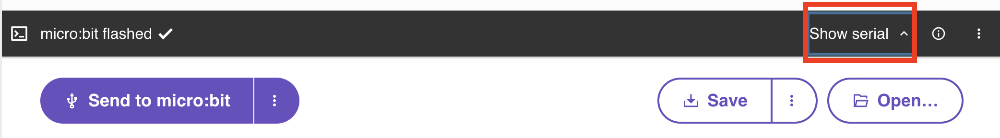

# It's alive

Let's bring our bird alive with code!

<p align="center">

</p>


## What is all this about?


We're building a beautiful flock of unique, original birds.

Your job, as a creator of one of the flock, is to think like a bird and programme the micro:bit to react to the world like a bird. You might also find that you have responsibilities to the flock, too, like sharing useful information.

The micro:bit can communicate wirelessly with other micro:bits using [radio](https://microbit-micropython.readthedocs.io/en/v1.0.1/tutorials/radio.html#radio).
There will be a secret micro:bit in the room broadcasting radio messages to
all the birds indicating different events like "saying hello" or "there is a cat
around".

Apart from that, the micro:bit contains other sensors that your bird will react
to, for example, birds don't like to be shaken!

To programme the micro:bit with Python we use 
[MicroPython (click here for more info)](https://microbit-carlos.github.io/microbit-bird-activity/micropython/)
and brand new
[Python Editor (click here for more info)](https://microbit-carlos.github.io/microbit-bird-activity/editor/).


## First steps - Load the starter project into the editor

Okay, so the first step is to open this link to the Python Editor.
This link contains a flag to enable additional beta features:
<a href="https://python.microbit.org/v/beta?flag=audioSoundEffect" target="_blank">https://python.microbit.org/v/beta?flag=audioSoundEffect</a>

To start the activity we first need to load a project hex file into the editor.

Right click on this link and select "Save Link As" to save the hex file to your
laptop: [https://github.com/microbit-carlos/microbit-bird-activity/raw/main/src/bird/bin/flockbird.hex](https://github.com/microbit-carlos/microbit-bird-activity/raw/main/src/bird/bin/flockbird.hex)

And then drag and drop the hex file to the Python Editor. The editor might
warn you that this action will replace the project, you can click "Replace" to
accept it.

### So... What am I looking at?

The loaded hex file contains two Python files, to see them let's go to "Project"
section on the left sidebar:


In this view you can switch between the `main.py` file and the `bird.py`.

- The `bird.py` module contains some functionality for the bird to be able to
react to the world.
- The `main.py` file is the main code we will be working on.

Both files have some comments that should help clarify what some of the
code is doing, but there is no need to familiarise yourself with these yet,
as we'll work through the files as part of this activity.

The sidebar also have other useful sections:
- Reference: A place to explore the features of your micro:bit with Python
- API: The micro:bit MicroPython API developer documentation


## Reacting to events

You'll see at the top of `main.py` a function called `hello()` with a decorator
`@bird.react("hello")` on top:

```python
@bird.react("hello")
def hello():
    """Somebody is saying hi, how lovely!"""
    display.show(Image.HEART)
    sleep(400)
```

When the bird detects a hello message from the airwaves, it will run this
function and show a heart image in the micro:bit display for 400 milliseconds.

<p class="exercise">
Exercise: <br>
Birds can be very chatty, so your neighbours might be saying hello quite often.
<br>
Can you think of a way to alternate between showing `Image.HEART` and
`Image.HEART_SMALL`? That way it'll look like a beating heart!
</p>

[Solution](https://github.com/microbit-carlos/microbit-bird-activity/tree/main/solutions/1-hello-beating.md)

When you code is ready, click the purple "Send to micro:bit" button.
If WebUSB is not available in your browser, you can click the "Save" button
to download a hex file, and then copy that file into the `MICROBIT` USB drive.

### What was that! A cat?

There are several events the bird can react to, and seeing a cat is quite important for bird survival.

<p class="exercise">
Exercise: <br>
Let's do the following:<br>
- Copy and paste the "hello" example <br>
- Replace the function name to `cat()` <br>a
- Change the decorator argument from "hello" to "cat".<br>
<br>
What do you think the bird should do in this case?
<br>
Some examples of thing you can do can be found in the
<a href="https://microbit-carlos.github.io/microbit-bird-activity/micropython/#quick-things-to-do-with-the-microbit" target="_blank">MicroPython page</a>.
</p>

We also want to warn other birds around us,
let's do that by adding by this line at the end of the function :

```python
bird.warn_about_cat()
```

[Solution](https://github.com/microbit-carlos/microbit-bird-activity/tree/main/solutions/2-cat.md)


## Bird state

We've learned how to react to environment events (received via micro:bit
radio), what about things that happen directory to our bird?

Let's look further down `main.py` and we'll find this infinite loop.

```python
while True:
    # Look inside yourself and listen, how is your bird feeling?
    bird_state = bird.current_state()
    if bird_state == "chill":
        display.show(Image.HAPPY)
    sleep(100)
```

The function `bird.current_state()` uses the micro:bit on board sensors to
figure how your bird is doing.

<p class="exercise">
Exercise: <br>
Birds don't like to be shaken, so "angry" can also be one of the bird states
to code.
<br>
Let's expand that "if" statement with an "elif" and do something else when
the bird is "angry".
</p>

[Solution](https://github.com/microbit-carlos/microbit-bird-activity/tree/main/solutions/3-state-angry.md)


## SoundEffects

But hold on. What's with all these images on screens? Aside from their uncanny ability to fly (sorry Kiwi, Ostrich, Kakapo, Penguin, etc :( ) birds are probably most famous for the sounds they make

The micro:bit V2 has a built-in speaker, and a lot of the fun of building birds is giving them a unique voice.

```python
audio.play(audio.SoundEffect(
    freq_start=400,
    freq_end=900,
    duration=1000,
    vol_start=255,
    vol_end=0,
    wave=audio.SoundEffect.WAVE_NOISE,
    fx=audio.SoundEffect.FX_TREMOLO,
    interpolation=audio.SoundEffect.INTER_LINEAR
))
```

The Python REPL is a great place to quickly try some Python code.

To use the REPL, first connect to the micro:bit with the "Send to micro:bit"
button. And then press the "Show serial" on the right of the dark box:



Then the three dots menu on the right, and select the "Send Ctrl+C" option:


And there we go, the MicroPython REPL, where you can type or paste any Python
code you like, and it will execute it inmediately:


<p class="exercise">
Exercise: <br>
Can you come up with an "angry" sound for the bird state?
What kind of sound would a bird make if they spot a cat?
</p>

There is no "solution" for this exercise, be as creative as you'd like!

Have you tried playing multiple sounds one after another?
You can make an ever longer cooler sound 📢. 

```python
effect_one = audio.SoundEffect(
    freq_start=988,
    freq_end=440,
    duration=190,
    vol_start=255,
    vol_end=255,
    wave=audio.SoundEffect.WAVE_SINE,
    fx=audio.SoundEffect.FX_VIBRATO
)
effect_two = audio.SoundEffect(
    freq_start=2570,
    freq_end=440,
    duration=874,
    vol_start=255,
    vol_end=87,
    wave=audio.SoundEffect.WAVE_SAWTOOTH,
    fx=audio.SoundEffect.FX_VIBRATO
)

audio.play(effect_one)
audio.play(effect_two)
```


## More events, more sounds

There are other events that can be programmed, the full list is:

- `hello`: Say hi to the flock
- `cat` : There is a predator below
- `hawk`: There is a predator above
- `dawn`: It's time to wake up
- `dusk`: It's time to go to sleep

What kind of sounds would you create for each one of these?

You can add more functions with the `@bird.react("event")` decorator to play
a different Sound Effect on each of these events.
