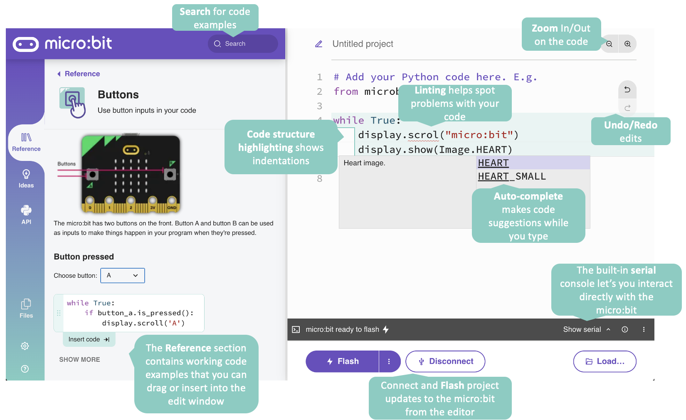

# New Online Python Editor

From inception the BBC micro:bit has been programmable with Python, with either
the [Online Python Editor](https://python.microbit.org) or
[other editors](https://microbit.org/code/#other-editors), like the
[Mu Editor](https://codewith.mu/).

And now the Micro:bit Educational Foundation has been building the next
generation of the Online Python editor. The one you'll be using through this
activity!

The new editor has been built from the ground-up with classroom use in mind, and it aims to make text-based coding more accessible to students who may find it hard to engage with the subject by removing known barriers to learning.

For a walk through of all the features of the new editor see this
[Python Editor Guide](https://support.microbit.org/support/solutions/articles/19000135210-python-editor-guide).

If you have any feedback we'd love to hear it! We should be around the
MakerFest area at EuroPython 2022. Or you can use the "Feedback" link at the
bottom left area of the editor.

And remember, we are still on beta, so some things might not be quite working.
If you find any issues please let us know in person, or you can open an issue
in the [Python Editor GitHub repository](https://github.com/microbit-foundation/python-editor-next/issues).
