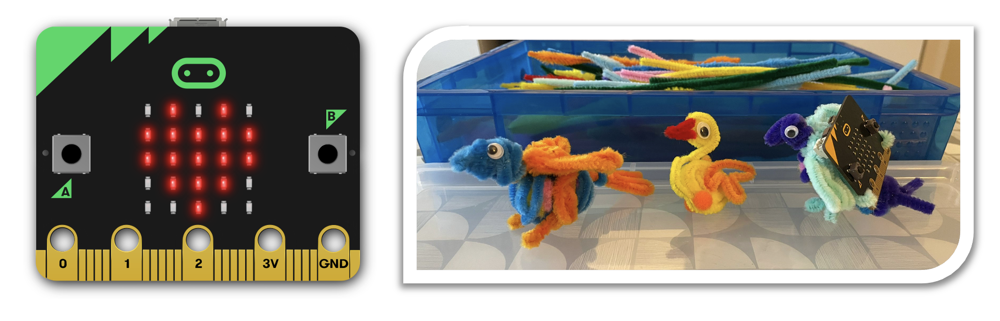

# BBC micro:bit Bird Activity

Hi! 👋

Welcome to the micro:bit Bird Activity page.

## What will we do today? 🤷‍♂️

With this micro:bit activity we will:

1. Build a bird, with pipe cleaners (optional but really fun!)
2. Program the bird with the help of a `bird.py` module
    - We are going to use the new micro:bit Python Editor!
3. Think like a bird and decide how a  bird reacts to events in the world and
  as part of the flock
4. Along the way, make some super cool sounds with a new synthesizer feature,
  and submit them for consideration as new default sounds!

## What you'll need ☑️

What we need you to bring:

- 1 laptop with a web browser and a USB port
    - A Chrome based browser works best for direct connection to the micro:bit
      but it is not necessary.
    - A USB-A port or an adaptor for one is ideal, but we may have some spare
      adaptors

What we can loan you:

- 1 micro:bit
- 1 USB cable
    - If you only have USB C ports let us know as we have a few adaptors
- 1 battery holder (optional)

What you can keep!

- 1 bird of your making (optional, but really fun!)

## micro:bit Python Editor 🐍

For this activity we are going to use the brand new micro:bit Python Editor.

The editor is still in beta, so we'd also love you to think about how we
could improve it and make suggestions. It's designed primarily for students
in schools, but we think it's pretty useful for anyone who wants to code with
Python and the BBC micro:bit.

On top of that, we are going to load it with a special flag to enable even
more new features, which you will be one of the first people to check out!

[https://python.microbit.org/v/beta?flag=audioSoundEffect](https://python.microbit.org/v/beta?flag=audioSoundEffect)

You can find more information about the editor in the
[Python Editor page](editor).

## Birds! 🦜 🐥 🦉

And we are going to make some birds using some craft supplies.

Don't worry, if this is not your thing you can still try all this without the
bird, but it is a lot more fun with one!

To see some bird making examples see the [Bird Pipe Cleaners page](birdcraft).

## Coding Activity 👩‍💻

And now that we are all ready, let's get coding!

Check out the [Coding Activity page](activity).

## Make some noise! 🔊

One of the other brand new features we are showcasing today is the creation
of Sound Effects!

This is a new feature we just added to MicroPython and we'd love to see what
you can do with it.

We are in the process of making the pre-built Sound Effect that will ship by
default with MicroPython for the micro:bit, so if you have a good SoundEffect
you'd like to suggest, please
[submit them here](https://microbit-carlos.github.io/microbit-bird-activity/submitse/).
